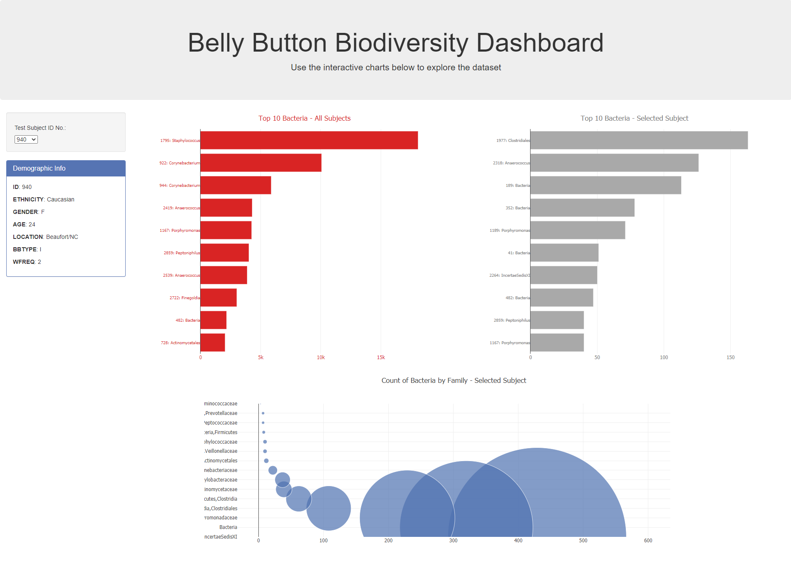

# Plotly Challenge

## Objective

This code builds an interactive dashboard to explore the Belly Button Biodiversity dataset, which catalogs the microbes that colonize human navels.
The dataset reveals that a small handful of microbial species (also called operational taxonomic units, or OTUs, in the study) were present in more than 70% of people, while the rest were relatively rare.

## Results
The interactive plots describing the data per subject and for the entire population can be seen at: https://adrianaovalle.github.io/plotly-challenge/

